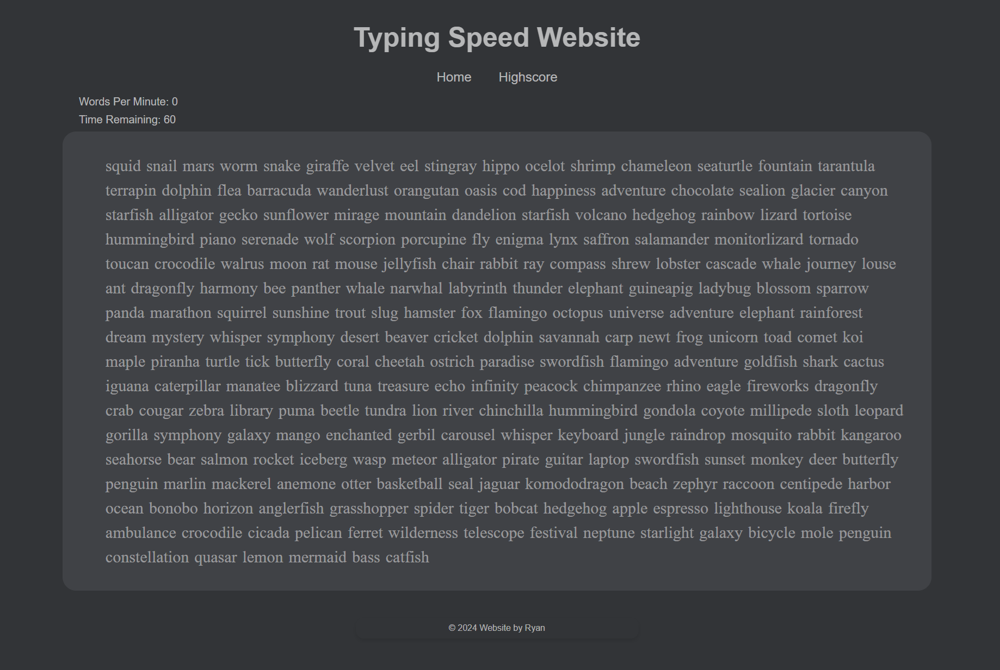

# TypingTest_React

Frontend and Backend TypingTest Application that uses `React Typescript` and `C# ASP.NET`
<br>


## Features

- Only checks new word on _space_ enter
- Stores Words Per Minute in a database for improvement reference

<br>

## Getting Started

Clone the Repo, enter in desired directory:

```
git clone https://github.com/FrokSo/TypingTest_React.git
```

<br>

## Dependencies

**Frontend**

- To install Frontend dependencies:

  - Ensure npm is installed with `npm --version`, else install from: [node.JS Website](https:node.js.org)
  - Enter the following commands:

```
cd react-app
npm install
```

<br>

| Dependency | Version |
| ---------- | ------- |
| Typescript | 5.2.2   |
| React      | 18.2.66 |
| Axios      | 1.7.2   |
| React-Dom  | 18.2.22 |
| Vote       | 5.2.0   |

<br>

**Backend**

- To install Backend dependencies:
  - Ensure C#.NET 8.0 is installed with `dotnet --version`, else install from: [dotnet Website](https://dotnet.microsoft.com/en-us/download/dotnet/8.0)

| Dependency              | Version      |
| ----------------------- | ------------ |
| C#                      | .NET 8.0     |
| EntityFrameworkCore     | 8.0.8        |
| EntityFrameworkCore.sql | 8.0.6        |
| Swashbuckle.AspNetCore  | 6.4.0        |
| MS SQL                  | 2022 Express |
| SSMS                    | 2022         |

<br>

## Configuration

In the backend project, under appsettings.json file, change _DefaultConnection_ to your MS SQL Server name

```
"DefaultConnection": "Server=YOURSERVERNAME;Database=TypingTest;Integrated Security=TrueTrustServerCertificate=True;"

```
